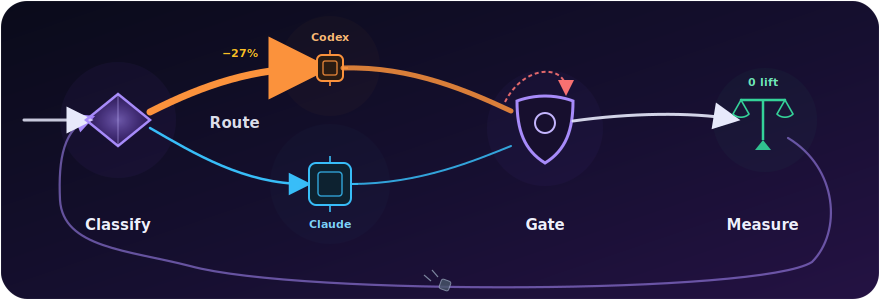

# fable-method-harness

[](https://github.com/WenyuChiou/fable-method-harness/actions/workflows/validate.yml)
[](LICENSE)
[](SETUP.md)

**English** | [繁體中文](README.zh-TW.md)


> **Fable-grade planning discipline for any AI agent — measured token savings
> on long tasks, a self-improvement loop that publishes its own losses, and
> zero capability lift by design.**

*"Fable-grade" means the working method, not a model you need: this repo
distills the observable planning discipline of a project driven by a frontier
Claude-class orchestrator (internally shorthanded "Fable") — classify first,
load only what the task needs, route cheap work to a cheap model, gate every
"done" claim. The discipline is portable to any agent; no particular model is
required, and no affiliation is implied.*

Here's the one thing most agent-framework READMEs can't say: **this harness
measures itself with pre-registered experiments and publishes the losses — it
recently removed its own flagship feature because the A/B said so.** The
machinery lost to a plain baseline on a frozen bar, so it came out the same
day, with the losing scorecard published next to the removal
([the numbers and the removal](docs/rolling_loop_simplification_rec_2026_07_14.md)).
It only keeps what survives measurement — and asks you to work the same way.

## The numbers, fast

| Lever | Result |
|---|---|
| **Codex, long tasks** (inline micro-contract vs plain Codex) | **−27% input tokens · −59% tool calls · −34% wall-clock** (80-trial confirmatory A/B; a flat context dump costs 2.2× for no quality gain) |
| **Hermes, routine-work context** (separate offline `prompt-size` measurement) | **−4,191 B / −69.9%** fixed project context, with no API call; separately, the pre-registered v3 live probe passed 4/4 triggers, 0/2 routine over-triggers, and 1/1 real-marker rollback on **both Hermes and Codex** |
| **Adaptive learning loop, 6 paired cases per runtime** | **Codex only:** 1 defect and 1 corrective invocation prevented; 0.858288 total-token ratio (−14.17%) and 0.672159 latency ratio (−32.78%) under one frozen binding. **Hermes:** all 12 pair-sides ended in process error, so token/correctness effect is **UNSCORED**, not a win or a loss. |
| **Claude, cost routing** (mixed workload vs all-strong-model) | **0.37×** the cost at exact quality parity (3/3 = 3/3), 30/30 blind routing accuracy, 0 honesty mis-routes |
| **Claude, one-call orientation** (`route_pack.py`) | **0.72×** total cost and *fewer* turns than free reading (11.3 vs 16.0) |
| **Capability lift** | **zero, across 8 experiments — by design.** This is the point, not a disclaimer. |

Full ledger — every row re-runnable, negative results included:
**[`docs/evidence.md`](docs/evidence.md)**.

## Quick start

```bash
git clone https://github.com/WenyuChiou/fable-method-harness
cd fable-method-harness
git config core.hooksPath scripts/hooks
python validation/integration_check.py   # 59 checks, ~3 min
```

Or hand the repo to an agent — one idempotent script, any agent can run it:

> Read `SETUP.md` and set this up.

Then, for a real task:

> Read `core/GLOBAL_BOOTSTRAP.md` and follow its routing for this task.

New to the harness? Start with the user-facing [adoption guide](docs/adoption-guide.md):
decide whether it fits your project, generate the minimal Codex/Hermes wiring,
roll it back, and measure your own result before expanding it.

## If you drive Codex

- **Long-task micro-contract** — a small inline contract instead of a flat
  context dump or repeated re-discovery. Confirmatory four-arm run, 80 trials
  (5/cell): **−27% input tokens, −59% tool calls, −34% wall-clock** vs plain
  Codex; the flat-dump arm cost **2.2×** the micro-contract for no quality
  gain. Progressive disclosure beats dumping everything up front — measured,
  with a pointer-control arm ruling out "any pointer would do."
- Honest limit, stated because the discipline requires it: the **correctness**
  lift is *not* established (p = 0.28) — what's measured is efficiency, not
  smarter answers.
- Start at [`AGENTS.md`](AGENTS.md) ·
  [`docs/codex_harness_integration.md`](docs/codex_harness_integration.md) ·
  evidence in [`docs/codex_long_task_ab.md`](docs/codex_long_task_ab.md).

## If you drive Hermes

- **Conditional shim** — [`HERMES.md`](HERMES.md) is deliberately short. It
  keeps a routine question, lookup, typo, or one-file mechanical edit out of
  the full harness; it activates for multi-step work, multiple agents,
  benchmarks, completion/release/safety/governance work, or explicit harness
  requests.
- **Measured boundary** — the pre-registered v3 live probe: Hermes and Codex
  each passed **4/4** required activations, **0/2** routine over-triggers, and
  **1/1** real rollback-marker case, with **7/7 exact** provider-usage rows.
  A separate deterministic, no-API `hermes prompt-size` measurement found the
  final shim cut fixed project context from **5,994 B to 1,803 B (−69.9%)**.
- Honest limit: this establishes correct conditional behavior and a context
  reduction, **not** an API-token reduction or speedup. See
  [`docs/runtime_activation_telemetry_2026_07_15.md`](docs/runtime_activation_telemetry_2026_07_15.md).

## If you drive Claude (or any strong/cheap model pair)

- **Cost router** — the strong model triages; the mechanical majority goes to
  a cheap model, the honesty-critical minority stays strong. Confirmed blind
  at k=3 (three repeated runs): routed cost **0.37×** all-strong,
  whole-workload quality **3/3 = 3/3**, routing accuracy **30/30**, **0**
  honesty mis-routes. An earlier 6-subtask pilot also showed why routing —
  not the cheap model — buys the stability: a naive all-cheap baseline scored
  **0.00** whole-workload there, missing the one subtle-honesty subtask every
  time (0/5). (`core/model_routing_playbook.md`)
- **One-call orientation** — `python scripts/route_pack.py <task_type>`
  returns the route plus every required file in one call. Live A/B: total
  cost **0.72×** free orientation, content-read **0.67×**, fewer turns than
  free. Context loaded per task is **~4–5%** of the repo by design (a static
  byte count, not a live total-cost promise — the numbers above are the live
  ones).

## Built for long jobs — and it improves itself

Use it where a mistake is expensive: long or multi-step work where state
drifts, multi-agent runs, cost-sensitive bulk work, completion claims,
governance changes. It improves itself the same way it asks you to work —
pre-registered A/Bs with a frozen bar, decided before the run:

- **Positive, shipped:** `route_pack.py` is the product of that loop — rounds
  1–2 of a same-day series *missed* their frozen bars (0.84× on total cost,
  0.73× on content-read — each round's bar was on a different metric), the
  miss was diagnosed (turn-replay overhead), round 3 met its bar and shipped.
- **Negative, shipped anyway:** the rolling-loop's REC-linkage machinery was
  tested against plain re-derivation from the same history. Manual recall came
  back **1.00** against the **<0.90** bar the automation needed — so it was
  **removed, per its own frozen criterion**. What survives: the deterministic
  report + brief emitter (**~1.3k tokens/run** vs **15k–89k** re-deriving by
  hand).
- **A third executor, gated the same way:** Antigravity CLI (`agy`) became a
  routed delegate only after a pre-registered k=5 reliability gate went
  **5/5** — decoy file byte-unchanged, planted judgment question escalated,
  no self-grading.

The loop is in the repo and propose-only — you disposition, agents never
self-approve:

```bash
python scripts/run_ai_review.py --mode scheduled_review   # report-only scan
python scripts/grep_history.py --repeats                  # what keeps coming back
python scripts/grep_history.py --open                     # what is still unapplied
```

## How it works



One pass, four disciplines: **Classify** (the strong model decides, never a
cheap one) → **Route** (mechanical bulk to the cheap lane, honesty-critical
work stays strong) → **Gate** (verify-file, completion-honesty, review — a
"done" claim has to pass, not be believed) → **Measure** (pre-registered
A/Bs with frozen bars; winners ship, losers get removed, both get published).

## Before / after — what changes when you use it

Same task, same model — the harness changes *how* you work, not how smart the
model is.

| | Ad-hoc (no harness) | With the harness |
|---|---|---|
| **Context per task** | bulk-read the repo (~303k tokens) | classify, then one-call orientation (**0.72×** total cost live) |
| **Cost on mixed work** | one model for everything | cheap model on the bulk, strong one reserved → **0.37×** at quality parity, when routing is accurate |
| **Long Codex tasks** | flat context dump | inline micro-contract → **−27% / −59% / −34%** tokens / calls / time |
| **A subtle-honesty slip** | can ship silently | reserved to the strong model behind a HALT/UNSCORED gate (all-cheap misses it 0/5) |
| **A feature that stops earning its keep** | lingers, defended by inertia | gets a frozen A/B and comes out if it loses — in public |
| **Review reports** | the model writes them (output tokens) | rendered from JSON (**~0** output tokens) |
| **A "done / passing" claim** | trusted as written | a completion-honesty gate runs first |
| **Raw capability** | already at the ceiling | **unchanged — zero lift, by design** |

**Skip it** for one-line edits, typo fixes, or "make the model smarter" asks —
there it adds ceremony without benefit (also measured: a forced run on a
one-typo control added overhead and no quality).

## How agents enter it

Same harness, one portable pointer per runtime. The **Status** column is
honest about what is actually tested — reserved slots are placeholders, not
compatibility claims.

| Runtime | Entry | Status |
|---|---|---|
| Claude Code | `SKILL.md` (auto-discovered) | operational cases demonstrated (Haiku + Sonnet, n=1 per case) |
| Codex | `AGENTS.md` · `docs/codex_harness_integration.md` | long-task efficiency **confirmed** (80-trial A/B: −27%/−59%/−34%); scoped-edit compliance demonstrated (n=1) |
| Cursor · opencode · any AGENTS.md agent | `AGENTS.md` (convention) | enters by convention; not separately benchmarked |
| Hermes | `HERMES.md` · `AGENTS.md` | conditional activation verified: 4/4 triggers, 0/2 routine over-triggers, 1/1 marker rollback, 7/7 exact usage rows; fixed context −69.9% |
| Antigravity CLI · other agent CLIs | `core/GLOBAL_BOOTSTRAP.md` pointer | as a **delegate**: promoted after a pre-registered k=5 gate went 5/5; as the driving agent: reserved, not yet tested |
| Bare model or shell | `BOOTSTRAP.md` · `core/GLOBAL_BOOTSTRAP.md` | portable pointer |

One rule for all of them: **classify the task, load only the routed files, do
not bulk-read the repo.** `python scripts/setup_harness.py --print-wiring`
prints the pointer to drop into another repo.

## The honesty boundary (read before adopting)

**Eight experiments show zero capability lift.**
A frontier model is already at the ceiling this harness could push against —
so "makes your model smarter" is explicitly, measurably false, and this repo
says so itself. What it buys instead, each line with a re-runnable artifact:
cost (**0.37×** routing · **0.72×** orientation, −27%/−59%/−34% on long Codex
tasks),
discipline (an explicit HALT beats a confident wrong guess), reliability
(delegates get promoted only through pre-registered gates), and audit (~30
defects caught while building itself — self-referential, no third-party
project data yet; review reports render at ~0 output tokens). Read
[`docs/evidence.md`](docs/evidence.md) — positives, negatives, and how to
re-derive each — before you adopt.

## Repository map

| Path | What's there |
|---|---|
| `core/` | Portable discipline for any project |
| `ROUTES.yaml` | Task type → exact required file set |
| `.claude/skills/adaptive-harness/` | Runtime-agnostic harness-audit adapter |
| `scripts/`, `validation/` | Deterministic runners and checks |
| `docs/` | Evidence, routing policy, publication status, operator runbook |
| `benchmarks/`, `evals/` | Public cases · local-only raw runs (gitignored) |

## Safety

Public repo. No secrets, private chat exports, hidden reasoning, or telemetry.
Generated reports stay out of git by design. Re-run the checklist in
`docs/publication_status.md` before any release.

## Contributing

- Every new claim needs a re-runnable artifact; mark unmeasured dimensions
  `UNSCORED`, not guessed.
- If a measurement says a feature isn't earning its keep, remove it — with
  the losing scorecard published alongside the removal.
- Keep route files small and explicit.
- Run `python validation/integration_check.py` before proposing a change.

## License

MIT. See `LICENSE`.
