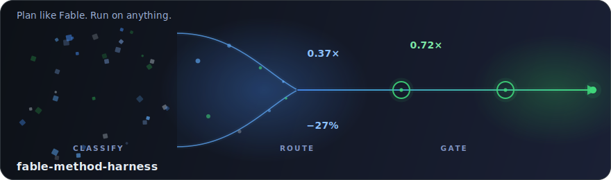

# fable-method-harness

[](https://github.com/WenyuChiou/fable-method-harness/actions/workflows/validate.yml)
[](LICENSE)
[](SETUP.md)

[English](README.md) | **繁體中文**



> **給任何 AI agent 的 Fable 等級規劃紀律——長任務實測省 token、
> 一個會發表自身敗績的自我改進迴路、以及設計上為零的能力提升。**

*「Fable 等級」指的是工作方法,不是你需要哪個模型:本 repo 蒸餾的是一個由
前沿 Claude 級協調者(內部簡稱「Fable」)驅動的專案中可觀察到的規劃紀律——
先分類、只載入任務需要的檔案、便宜的工作交給便宜的模型、每個「完成」聲稱
都要過閘門。這套紀律可攜至任何 agent;不需要特定模型,也不暗示任何隸屬
關係。*

多數 agent 框架的 README 說不出這句話:**這個 harness 用預先註冊的實驗量測
自己,而且會發表敗績——它最近因為 A/B 結果而移除了自己的旗艦功能。** 那套
機制在凍結的標準下輸給了樸素的基準線,所以當天就被拆除,敗方計分卡與移除
記錄一起公開
([數字與移除記錄](docs/rolling_loop_simplification_rec_2026_07_14.md))。
它只保留通過量測的東西——並且要求你用同樣的方式工作。

## 數字,先看這裡

| 槓桿 | 結果 |
|---|---|
| **Codex 長任務**(行內 micro-contract vs 素的 Codex) | **−27% 輸入 tokens · −59% 工具呼叫 · −34% 耗時**(80 次試驗確認性 A/B;整包傾倒脈絡的做法貴 2.2 倍且品質毫無提升) |
| **Claude 成本路由**(混合工作負載 vs 全強模型) | **0.37×** 成本、品質完全持平(3/3 = 3/3)、盲路由準確率 30/30、誠實任務誤路由 0 |
| **Claude 一次呼叫定向**(`route_pack.py`) | **0.72×** 總成本,回合數*少於*自由閱讀(11.3 vs 16.0) |
| **能力提升** | **零,橫跨 8 個實驗——這是設計目標。** 這是重點,不是免責聲明。 |

完整帳本——每一列可重跑、負面結果照列:
**[`docs/evidence.md`](docs/evidence.md)**。

## 快速開始

```bash
git clone https://github.com/WenyuChiou/fable-method-harness
cd fable-method-harness
git config core.hooksPath scripts/hooks
python validation/integration_check.py   # 59 項檢查,約 3 分鐘
```

或者直接把 repo 交給一個 agent——一個冪等腳本,任何 agent 都能執行:

> Read `SETUP.md` and set this up.

然後,對一個真實任務:

> Read `core/GLOBAL_BOOTSTRAP.md` and follow its routing for this task.

## 如果你開的是 Codex

- **長任務 micro-contract**——用一小段行內契約取代整包脈絡傾倒或反覆重新
  摸索。確認性四臂實驗、80 次試驗(每格 5 次):**−27% 輸入 tokens、−59%
  工具呼叫、−34% 耗時** vs 素的 Codex;整包傾倒那一臂貴 **2.2 倍**且品質
  毫無提升。漸進式揭露勝過一次全倒——有量測、有指標控制臂排除「隨便給個
  指標就有效」的解釋。
- 誠實界線(紀律要求必須講):**正確性**提升並未成立(p = 0.28)——量到的
  是效率,不是更聰明的答案。
- 入口:[`AGENTS.md`](AGENTS.md) ·
  [`docs/codex_harness_integration.md`](docs/codex_harness_integration.md) ·
  證據在 [`docs/codex_long_task_ab.md`](docs/codex_long_task_ab.md)。

## 如果你開的是 Claude(或任何強/弱模型配對)

- **成本路由器**——強模型分診;機械性的多數交給便宜模型,誠實性關鍵的
  少數留在強模型。k=3(三次重複)盲測確認:路由後成本為全強模型的
  **0.37×**,整體品質 **3/3 = 3/3**,路由準確率 **30/30**,誠實任務誤路由
  **0**。另一個較早的 6 子任務試點說明了為什麼是路由(而非便宜模型本身)
  買到穩定性:樸素的全便宜基準線在那裡整體得分 **0.00**——那個微妙的誠實
  子任務每次都漏(0/5)。(`core/model_routing_playbook.md`)
- **一次呼叫定向**——`python scripts/route_pack.py <task_type>` 一次回傳
  路由條目加上所有必要檔案。實測 A/B:總成本為自由定向的 **0.72×**、
  內容讀取 **0.67×**、回合數少於自由閱讀。每個任務載入的脈絡依設計約為
  repo 的 **4–5%**(靜態位元組推導,不是即時總成本的承諾——上面那兩個
  才是即時數字)。

## 為長任務而生——而且它會自我改進

用在犯錯代價高的地方:狀態會漂移的長任務或多步驟工作、多 agent 執行、
成本敏感的批量工作、完成聲稱、治理變更。它用要求你的同一套方式改進
自己——預先註冊的 A/B、事前凍結的標準:

- **正面案例,已出貨:**`route_pack.py` 就是這個迴路的產物——同日系列的
  第 1、2 輪*未達*各自的凍結標準(總成本 0.84×、內容讀取 0.73×——每輪的
  標準在不同的指標上),診斷出原因(回合重播開銷)後,第 3 輪達標出貨。
- **負面案例,照樣出貨:**rolling loop 的 REC 連結機制被拿去跟同一段歷史
  的樸素重推導對比。人工重推導的召回率是 **1.00**,勝過自動化機制賴以
  自我辯護的 **<0.90** 標準——所以它被**依照自己的凍結準則移除**。存活下
  來的是確定性的報告+摘要產生器(每次執行約 **1.3k tokens**,對比人工
  重推導的 **15k–89k**)。
- **第三條執行者通道,用同一套閘門把關:**Antigravity CLI(`agy`)在
  預先註冊的 k=5 可靠性閘門 **5/5** 全過之後才成為可路由的 delegate——
  誘餌檔案位元組不變、植入的判斷題被上報而非擅自處理、全程無自評。

迴路就在 repo 裡,而且是 propose-only——你做決定,agent 永不自我批准:

```bash
python scripts/run_ai_review.py --mode scheduled_review   # 純報告掃描
python scripts/grep_history.py --repeats                  # 什麼一直重複出現
python scripts/grep_history.py --open                     # 什麼還沒被套用
```

## 它怎麼運作


一趟流程、四道紀律:**Classify**(由強模型決定,永遠不是便宜模型)→
**Route**(機械批量走便宜通道,誠實性關鍵留在強模型)→ **Gate**
(verify-file、完成誠實檢查、review——「完成」聲稱要通過,而不是被相信)→
**Measure**(預先註冊、標準凍結的 A/B;贏家出貨、輸家移除,兩者都發表)。

## 使用前後——它改變了什麼

同一個任務、同一個模型——harness 改變的是你*怎麼*工作,不是模型多聰明。

| | 隨手做(無 harness) | 用 harness |
|---|---|---|
| **每任務脈絡** | 整包讀 repo(約 30.3 萬 tokens) | 先分類,再一次呼叫定向(實測總成本 **0.72×**) |
| **混合工作的成本** | 一個模型包辦全部 | 批量給便宜模型、強模型保留 → 路由準確時 **0.37×** 且品質持平 |
| **Codex 長任務** | 整包脈絡傾倒 | 行內 micro-contract → **−27% / −59% / −34%**(tokens / 呼叫 / 耗時) |
| **微妙的誠實滑失** | 可能無聲出貨 | 保留給強模型、置於 HALT/UNSCORED 閘門之後(全便宜模型 0/5 全漏) |
| **不再值回票價的功能** | 靠慣性苟活 | 接受凍結標準的 A/B,輸了就移除——公開地 |
| **Review 報告** | 模型寫(燒輸出 tokens) | 由 JSON 確定性渲染(**~0** 輸出 tokens) |
| **「完成/通過」聲稱** | 照單全收 | 先過完成誠實閘門 |
| **原始能力** | 已在天花板 | **不變——零提升,by design** |

**跳過它**:單行修改、錯字修正、或「讓模型更聰明」這類請求——在那裡它
只添儀式不添效益(也量過:對單一錯字的控制組強制跑一輪,多了開銷、品質
零提升)。

## Agent 怎麼進入

同一個 harness,每個 runtime 一個可攜指標。**Status** 欄誠實區分「實際
測過」與「接好線但未測」——保留欄位是佔位,不是相容性聲稱。

| Runtime | 入口 | 狀態 |
|---|---|---|
| Claude Code | `SKILL.md`(自動發現) | 操作案例已示範(Haiku + Sonnet,每案例 n=1) |
| Codex | `AGENTS.md` · `docs/codex_harness_integration.md` | 長任務效率**已確認**(80 次試驗 A/B:−27%/−59%/−34%);scoped-edit 合規已示範(n=1) |
| Cursor · opencode · 任何 AGENTS.md agent | `AGENTS.md`(慣例) | 依慣例進入;未單獨測試 |
| Hermes · 路由器表面 | `docs/agent-routing-policy.md` | 僅路由——確定性掃描後,把判斷路由出去 |
| Antigravity CLI · 其他 agent CLI | `core/GLOBAL_BOOTSTRAP.md` 指標 | 作為 **delegate**:預註冊 k=5 閘門 5/5 通過後晉升;作為駕駛 agent:保留,未測 |
| 裸模型或 shell | `BOOTSTRAP.md` · `core/GLOBAL_BOOTSTRAP.md` | 可攜指標 |

所有人共用一條規則:**先分類任務、只載入路由指定的檔案、不整包讀
repo。**`python scripts/setup_harness.py --print-wiring` 會印出可放進其他
repo 的指標。

## 誠實邊界(採用前請讀)

**八個實驗顯示能力提升為零。** 前沿模型早已站在這個 harness 所能推的天花
板上——所以「讓你的模型更聰明」是明確、可量測地不成立的,而且這個 repo
自己就這麼說。它買到的是(每一項都有可重跑的 artifact):成本(路由
**0.37×** · 定向 **0.72×**,Codex 長任務 −27%/−59%/−34%)、紀律(明確的
HALT 勝過自信的錯誤猜測)、可靠性(delegate 只能透過預註冊閘門晉升)、
以及稽核(建造自身期間抓到約 30 個缺陷——自我參照,尚無第三方專案數據;
review 報告以 ~0 輸出 tokens 渲染)。採用前請讀
[`docs/evidence.md`](docs/evidence.md)——正面、負面、以及每一項如何重新
推導。

## Repo 地圖

| 路徑 | 內容 |
|---|---|
| `core/` | 可攜至任何專案的紀律 |
| `ROUTES.yaml` | 任務類型 → 精確的必要檔案集 |
| `.claude/skills/adaptive-harness/` | 與 runtime 無關的 harness 稽核轉接層 |
| `scripts/`、`validation/` | 確定性的執行器與檢查 |
| `docs/` | 證據、路由政策、發布狀態、操作手冊 |
| `benchmarks/`、`evals/` | 公開案例 · 僅本地的原始執行(gitignored) |

## 安全

公開 repo。無密鑰、無私人對話輸出、無隱藏推理、無遙測。生成的報告依設計
不進 git。任何發布前重跑 `docs/publication_status.md` 的檢查清單。

## 貢獻

- 每個新聲稱都需要可重跑的 artifact;未量測的維度標 `UNSCORED`,不猜。
- 若量測顯示某功能不值回票價,就移除它——並把敗方計分卡與移除一起發表。
- 路由檔案保持小而明確。
- 提出變更前先跑 `python validation/integration_check.py`。

## 授權

MIT。見 `LICENSE`。
